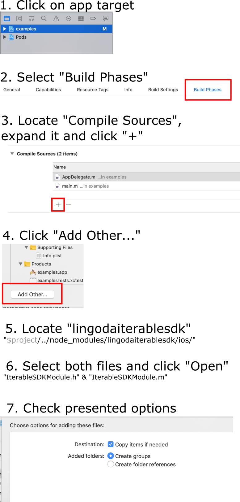

* `npm run install-examples` to install SDK to examples applications

```js
import IterableSDK from 'lingodaiterablesdk'

// required to initialize when the app starts
IterableSDK.init({ pushIntegrationName: 'my-push', apiKey: '<api-key>' })
    .then(() => console.log('IterableSDK initialization done'));

// when user logs in (activates push subscription)
IterableSDK.login({ email: 'hello@there.com' })
    .then(() => console.log('IterableSDK successfully logged in'));

// check permission (iOS requirement) will show system permission request dialog
// if no permission is granted. Please note that this method will always _resolve_
// even if user denied the request.
IterableSDK.checkPermission()
    .then(() => console.log('Checked for permission'));

// when user logs out (de-activates push subscription)
IterableSDK.logout()
    .then(() => console.log('IterableSDK user logged out'));
```

Additionally `debugLogging` can be customized during initialization:
```js
IterableSDK.init({ pushIntegrationName: /**/, apiKey: /**/, debugLogging: true })
```

## Your life is miserable?
* `react-native start --reset-cache` (really good one!)
* _to be continued..._


## Android Setup

### Initialize Firebase
[documentation](https://firebase.google.com/docs/android/setup) is available
1. Follow the first option (`Add Firebase using the Firebase console`)
2. Create Android application
3. Specify `packageName` of the app (the bundle that is used when releasing to Play Store)
   Can be found in `$root/app/build.gradle` file
```groovy
android {
    defaultConfig {
        // here is your packageName
        applicationId 'com.lingoda.android' // for example
    }
}
```
4. Additionally you can initialize other Firebase services like crash-reporting or analytics
5. Download generated `google-services.json` file
6. Put it in `$root/app/` folder
   Project folder structure should look like this:
```
root/
    app/
        build.gradle
        google-services.json
        src/main/...
    build.gradle
    settings.gradle
```
7. Open `$root/build.gradle` file and make sure it has these lines:
```groovy
buildscript {
    repositories {
        google() // (!) required
        // and some others if they are present
    }
    dependencies {
        classpath 'com.google.gms:google-services:4.3.3' // (!) required
        classpath 'com.android.tools.build:gradle:3.4.2'
        // maybe some others, depending on your project
    }
}
allprojects {
    repositories {
        google() // (!) required
        // others can be already present here
    }
    // other properties can also be here
}
```
8. Open `$root/app/build.gradle` file
```groovy
android {
    defaultConfig {}
}
dependencies {
    // Firebase messaging and IterableSDK are already added to your dependencies
    // but you still can specify them here
}

// (!) at the bottom of the file
apply plugin: 'com.google.gms.google-services'
```
9. Sync your project (clean/rebuild/invalidate-cache as always if something is not working)
 
### Initialize Iterable 
Please refer to the [documentation](https://support.iterable.com/hc/en-us/articles/115000331943-Setting-up-Android-Push-Notifications-)

### Add IterableSDKPackage
In your application (`MainApplication` for example) add `IterableSDKPackage`:
```java
@Override
protected List<ReactPackage> getPackages() {
    List<ReactPackage> packages = new PackageList(this).getPackages();
    packages.add(new IterableSDKPackage());
    return packages;
}
```

## iOS Setup

### Prepare app to receive push notifications
Read the [documentation on Iterable website](https://support.iterable.com/hc/en-us/articles/115000315806-Setting-up-iOS-Push-Notifications-).

_*there are a lot of things to do and unfortunately this cannot be abstracted or moved to a library_

### Background mode
Allow remote notification background mode ([UIBackgroundMode](https://stackoverflow.com/a/45440917/6745174))

### Add dependencies

Edit your `Podfile`:

```ruby
platform :ios, '9.0'
require_relative '../node_modules/@react-native-community/cli-platform-ios/native_modules'

# Iterable requirement, add if missing
use_frameworks!

target 'examples' do

  # Actual Iterable SDK
  pod 'Iterable-iOS-SDK'

  # rest omitted
```

Execute `pod install` command.


### Linking with IterableSDKModule

Refer to this iOS-y tutorial (can be found in `./README.md-assets/ios-linking.png` image):



The reason why code is not distributed via CocoaPods is - latest React Native version
does not come with pre-built `*.xcodeproj` file which makes it impossible to
link against React.

### AppDelegate

Edit `AppDelegate.h` file (implement `UNUserNotificationCenterDelegate`):

```objectivec
#import <React/RCTBridgeDelegate.h>
#import <UIKit/UIKit.h>

// required import
#import <UserNotifications/UserNotifications.h>

// add UNUserNotificationCenterDelegate to the list
@interface AppDelegate : UIResponder <UIApplicationDelegate, RCTBridgeDelegate, UNUserNotificationCenterDelegate>

@property (nonatomic, strong) UIWindow *window;

@end
```

Edit `AppDelegate.m`:

```objectivec
// Add on top
#import "IterableSDKModule.h"
```

```objectivec
- (BOOL)application:(UIApplication *)application didFinishLaunchingWithOptions:(NSDictionary *)launchOptions
{
  
  // Set notification center delegate to self
  UNUserNotificationCenter* notificationCenter = [UNUserNotificationCenter currentNotificationCenter];
  notificationCenter.delegate = self;
  
  // init `IterableSDKModule`
  [IterableSDKModule initWithLaunchOptions:launchOptions];
  
  // rest omitted (keep as-is)
  RCTBridge *bridge = [[RCTBridge alloc] initWithDelegate:self launchOptions:launchOptions];
  RCTRootView *rootView = [[RCTRootView alloc] initWithBridge:bridge
                                                   moduleName:@"examples"
                                            initialProperties:nil];
    ...
```

Add required new methods:

```objectivec
- (void)application:(UIApplication *)application didRegisterForRemoteNotificationsWithDeviceToken:(NSData *)deviceToken {
  [IterableSDKModule setDeviceToken:deviceToken];
}

- (void)application:(UIApplication *)application didReceiveRemoteNotification:(NSDictionary *)userInfo fetchCompletionHandler:(void (^)(UIBackgroundFetchResult))completionHandler {
  [IterableSDKModule application:application didReceiveRemoteNotification:userInfo fetchCompletionHandler:completionHandler];
}

- (void)userNotificationCenter:(UNUserNotificationCenter *)center willPresentNotification:(UNNotification *)notification withCompletionHandler:(void (^)(UNNotificationPresentationOptions))completionHandler {
  completionHandler (UNAuthorizationOptionAlert | UNAuthorizationOptionBadge | UNAuthorizationOptionSound);
}

- (void)userNotificationCenter:(UNUserNotificationCenter *)center didReceiveNotificationResponse:(UNNotificationResponse *)response withCompletionHandler:(void (^)(void))completionHandler {
  [IterableSDKModule userNotificationCenter:center didReceiveNotificationResponse:response withCompletionHandler:completionHandler];
}
```